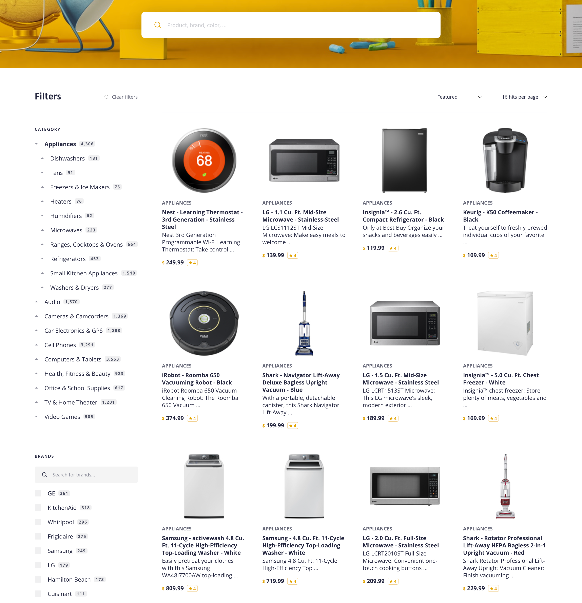
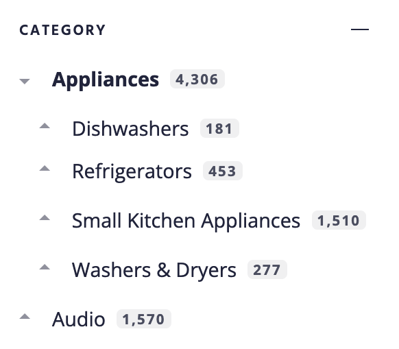
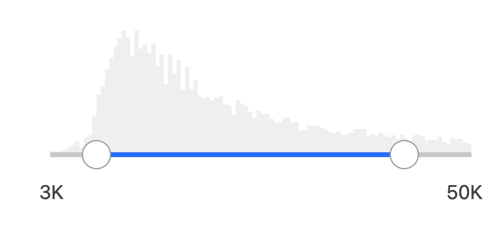
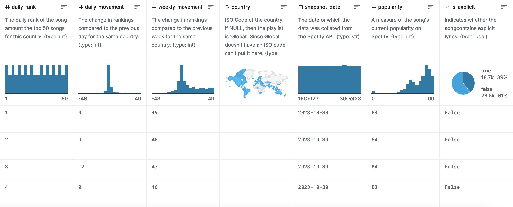
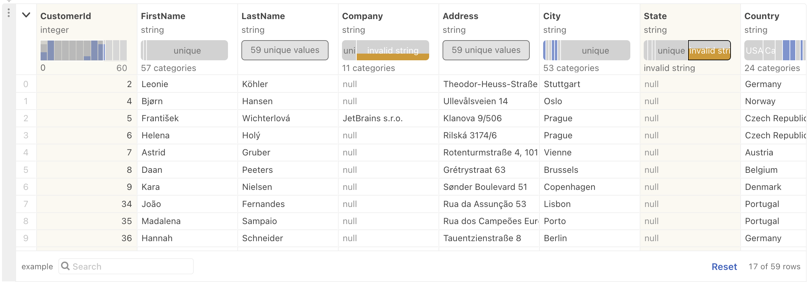
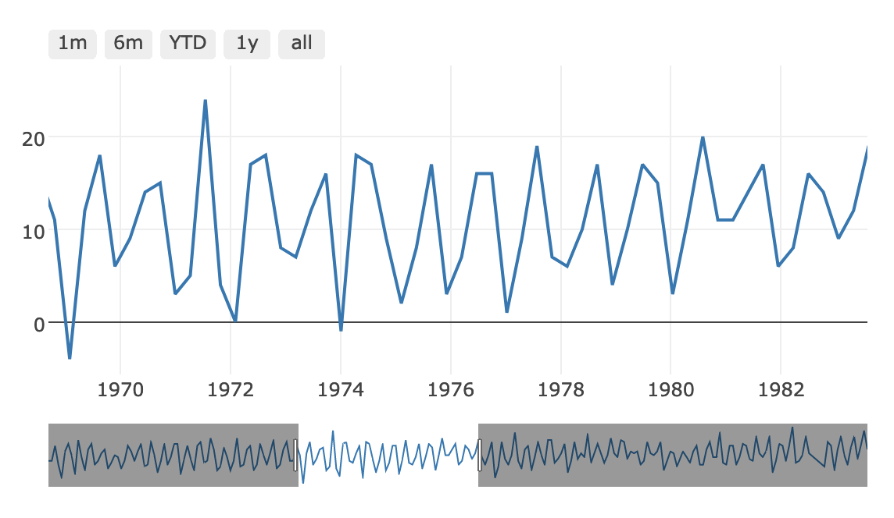
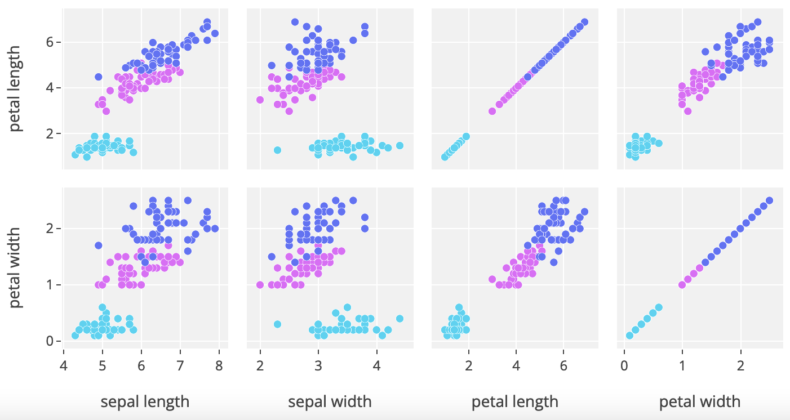

Faceted search is a parametric search with the difference that user can judge about distribution of results by different cataegories (facets) upfront. One more improvement is when the system sugests most relevant facets depending on the type of search. For example, if user searches:

- for screen - resolution and diagonal are relvant parameters
- for fridge - volume and energy efficiency are relevant parameters

## Examples

It would be easier to grasp the concept by checking examples: [algolia.com](https://www.algolia.com/doc/guides/building-search-ui/resources/demos/js/), [searchkit.co](https://www.searchkit.co/demos), [reactiveapps.io](https://www.reactiveapps.io/), [addsearch.com](https://demo.addsearch.com/search-ui-examples/components/), [search.io](https://react.docs.search.io/search-ui#completed-example), [coveo.github.io](https://coveo.github.io/coveo-search-ui-samples/), [analysis-tools.dev](https://analysis-tools.dev/tools).

### E-commerce example

Classical example of faceted search is search for e-commerce website.

Typically you would see following filters:

| Hierarchical      | Categorical       | Numerical range   |
| ----------------- | ----------------- | ----------------- |
|  |  |  |

Aditionaly there would be:

- results displayed as a grid (first screenshot) or as a list
- pagination
- sorting, for example by price, by popularity or relevance

### Rental website

Idea is the same, but additionally:

- results can be displayed on the map
  - [map itself can be used as filter](https://docs.mapbox.com/mapbox-gl-js/example/mapbox-gl-draw/)
- filter may include date range

### Related

Similar ideas can be seen in data tables, in computational notebooks, like Jupyter, Kaggle, Observable etc.:

| Kaggle                                                                                                         | Observable                                                                  |
| -------------------------------------------------------------------------------------------------------------- | --------------------------------------------------------------------------- |
|  |  |

Or in some plotting libraries

| Range slider                                                     | Scatterplot Matrix (SPLOM)                                |
| ---------------------------------------------------------------- | --------------------------------------------------------- |
|  |  |

## Backend

### Server

Typical solution is to use some kind of search engine with support for faceted search, for example:

- [meilisearch](https://www.meilisearch.com/docs/learn/fine_tuning_results/faceted_search)
- [typesense](https://typesense.org/docs/0.24.1/api/search.html#facet-results)
- [tantivy](https://github.com/quickwit-oss/tantivy)
  - There is [an attempt to compile it to WASM](https://github.com/phiresky/tantivy-wasm)
- Not a typical choice, but also may work - DuckDB, because it has [Full Text Search](https://duckdb.org/docs/extensions/full_text_search.html) and [GROUPING SETS](https://duckdb.org/docs/sql/query_syntax/grouping_sets)
  - there is [WASM version](https://duckdb.org/docs/api/wasm/overview.html), but it is kind of big

### UI

Except backend you would need some kind of UI. There are a lot of candidates:

- [instantsearch](https://github.com/algolia/instantsearch) Plain JS, React, Vue, Angular
  - [playground](https://instantsearchjs.netlify.app/stories/js/)
  - integrations:
    - [instant-meilisearch](https://github.com/meilisearch/meilisearch-js-plugins/tree/main/packages/instant-meilisearch)
    - [typesense-instantsearch-adapter](https://github.com/typesense/typesense-instantsearch-adapter)
    - [instantsearch-itemsjs-adapter](https://github.com/unplatform-io/instantsearch-itemsjs-adapter)
    - [searchkit-instantsearch-client](https://github.com/searchkit/searchkit/blob/main/packages/searchkit-instantsearch-client) (Elasticsearch)
- [reactivesearch](https://github.com/appbaseio/reactivesearch#3-component-playground) React, Vue
  - [playground](https://opensource.appbase.io/playground/)
- [AddSearch/search-ui](https://github.com/AddSearch/search-ui) Plain JS
- [coveo/search-ui](https://github.com/coveo/search-ui) Plain JS
- [sajari/search-ui](https://github.com/sajari/sdk-react/tree/master/packages/search-ui) React
- [Flowbite: Tailwind CSS Faceted Search Drawers](https://flowbite.com/blocks/application/faceted-search-drawers/)

## Client

But I'm more interested in client-side faceted search. There are a lot of client side full-text search engines:
 [orama](https://github.com/oramasearch/orama), [pagefind](https://github.com/cloudcannon/pagefind), [lunr.js](https://github.com/olivernn/lunr.js), [flexsearch](https://github.com/nextapps-de/flexsearch).

And even more fuzzy-text search "engines": [uFuzzy](https://github.com/leeoniya/uFuzzy), [fuse](https://github.com/krisk/fuse), [fzf-for-js](https://github.com/ajitid/fzf-for-js), [fuzzysort](https://github.com/farzher/fuzzysort),[quick-score](https://fwextensions.github.io/quick-score-demo/).

In similar way we can use faceted search at the client side. I found 3 libraries:

- [tanstack/table](https://tanstack.com/table/v8/docs/api/features/filters#getfacetedrowmodel)
- [orama](https://docs.oramasearch.com/open-source/usage/search/facets)
- [itemsjs](https://github.com/itemsapi/itemsjs)

### Experiment

I decided to try them out. I started with tanstack and `shadcn/ui` (React, Radix, TailwindCSS). Then I replaced faceting capabilities with Orama, but preserved UI. Then I replaced faceting capabilities with ItemsJS.

I found couple datasets for the demo:

- [algolia datasets](https://github.com/algolia/datasets/tree/master/ecommerce)
- [searchkit sample data](https://github.com/searchkit/searchkit/tree/main/sample-data/electronics-ecommerce)

Demo is not ideal, but enough to compare approaches:

- For filter with checkboxes I use `Comand` component, which is probably wrong. Instead component should be able to load more options and use some kind of fuzzy search
- Filter with slider misses number marks. See [#1188](https://github.com/radix-ui/primitives/issues/1188)
- Filters should be collapsible, like [Accordion](https://ui.shadcn.com/docs/components/accordion) component
- I need to store state of filter in URL
- UI "jumps" - scroll position changes unexpectedly (sometimes)

### Tanstack table native faceting

- [source code](https://github.com/stereobooster/faceted-search/tree/main/src/pages/tanstack)
- [demo](https://faceted.stereobooster.com/pages/tanstack/)

I'm impresed by Tanstack table, it packs so many features and has elegant API layer.

- Filter with checkboxes
  - Options should be sorted by frequency
  - Options should be limited to first 10-20, with ability to fetch more on request
- Search and sorting is done in main thread, so there is slight latency on keyboard input
- There is no full-text ssearch (only substring match), but this is irrelevant, because I'm mainly interested in faceting

### Tanstack table + Orama

- [source code](https://github.com/stereobooster/faceted-search/tree/main/src/pages/orama)
- [demo](https://faceted.stereobooster.com/pages/orama/)

I wanted to preserve the same UI, so I integrated Orama in Tanstack table.

Initial load of the data (10000 records) was so slow that I had to move it in Web Worker. Later, I limited demo to 1000 records.

Orama has decent full-text search, but faceting is sad:

- Filter with checkboxes
  - Options for `string` facets sorted by frequency, but for `string[]` are not
  - When option is selected it removes values from the same facet, but instead it should only change other facets
  - There is no way to limit number of options returned for the facet
- Filter with slider
  - There are no min and max values for facets, so this filter in demo is broken

And there are another small bugs.

### Tanstack table + ItemsJS

- [source code](https://github.com/stereobooster/faceted-search/tree/main/src/pages/itemsjs)
- [demo](https://faceted.stereobooster.com/pages/itemsjs/)

ItemsJS focuses on faceting, and full-text search is outsourced - by default, it uses Lunr. But you can switch to another solution, for example, [minisearch](https://github.com/itemsapi/itemsjs/blob/master/docs/minisearch-integration.md).

Secret sauce is [FastBitSet.js](https://github.com/lemire/FastBitSet.js/).

It supports:

- moving selected options to top
- limiting number of options per facet
- min, max values for numerical facets
- preserving unselected options in facets

I almost didn't find downsides, except:

- TypeScript signatures can be better (`extends {}`)
- For one letter search, it returns empty result, but I think this is due to full-text search engine

Other things to try:

- integrate different full-text or fuzzy search engine
- move it to Web Worker
- integrate with Instantsearch
- implement slider component with mini-plot
- implement date-range component
- implement hierarchical categories component, like file tree

### Other ideas and links

#### Prebuild index for static websites

Typical solution for search for static websites, like Hugo, is to load data as JSON in memory and then index it. Is there a way to build index upfront and fetch it from the server with [HTTP range request](https://developer.mozilla.org/en-US/docs/Web/HTTP/Range_requests)? It can be optimized-for-reads format, like [Parquet](https://github.com/kylebarron/parquet-wasm).

- [stork](https://github.com/jameslittle230/stork) (deprecated) has CLI for building index and JS library to consume it.
- [orama/plugin-data-persistence](https://github.com/oramasearch/orama/tree/main/packages/plugin-data-persistence) can store index data as JSON or as [dpack](https://www.npmjs.com/package/dpack), but not sure if stores raw data or index.
- [Pagefind](https://pagefind.app/docs/running-pagefind/) has CLI for building index and JS library to consume it.

#### Benchmarks for full text search

- [flexsearch/bench](https://nextapps-de.github.io/flexsearch/bench/)
- [uFuzzy: A biased appraisal of similar work](https://github.com/leeoniya/uFuzzy#a-biased-appraisal-of-similar-work)
- [tinysearch#136](https://github.com/tinysearch/tinysearch/issues/136)
- [orama#76](https://github.com/oramasearch/orama/issues/76)
