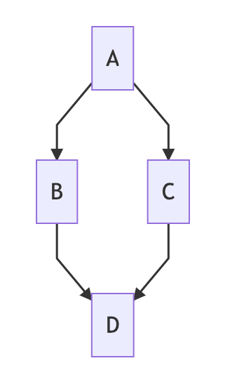

I like Markdown for its simplicity. Simplicity comes with limitations. There are some features that I miss in Markdown or it is possible to extend Markdown to support these cases, but there is no support from the Hugo side (static site generator I use).

<!--more-->

Note: I can't use JS to do additional rendering on the client-side, because:

- I crosspost my articles, which means that articles should contain only HTML and images (JS will not work on 3-rd party website)
- I care about the speed of my website and each JS script is a penalty for performance

## Features

### Diagrams

I would like to create diagrams with-in Markdown. Something like this:

````
```mermaid
graph TD;
    A-->B;
    A-->C;
    B-->D;
    C-->D;
```
````

Which would render:



Diagrams can be descirbed, for example, with: [flowchart.js](https://flowchart.js.org/), [js-sequence-diagrams](https://bramp.github.io/js-sequence-diagrams/), [mermaid](https://github.com/knsv/mermaid), [PlantUML](https://plantuml.com/), [WaveDrom](https://wavedrom.com/), [Viz.js](https://github.com/mdaines/viz.js), [vega](https://vega.github.io/vega/), [ditaa](https://github.com/stathissideris/ditaa), etc.

**Support**:

- Markdown: Yes
- Hugo: **[No](https://github.com/gohugoio/hugo/issues/796)**
- Editor preview: [Yes](https://github.com/shd101wyy/markdown-preview-enhanced/blob/master/docs/diagrams.md)

My workaround: use JS script which detects code-blocks with diagrams, renders them, and replaces code-blocks with the rendered images.

### Euler diagrams

See examples here:

- [eulerAPE](http://www.eulerdiagrams.org/eulerAPE/)
- [What is the best software for drawing a VENN diagram?](https://www.researchgate.net/post/What_is_the_best_software_for_drawing_a_VENN_diagram)

**Support**:

- Markdown: Yes
- Hugo: **No**
- Editor preview: **No**

### XKCD-style

I'd like to use XKCD-style for diagrams that are meant to illustrate something but are not based on scientific data.

For example, [xkcd #1064](https://xkcd.com/1064/):


````
```dot {style=xkcd}
digraph graphname {
  splines="curved";
  a -> b -> c;
  b -> d -> a;
}
```
````

**Support**:

- Markdown: Yes
- Hugo: **No**
- Editor preview: doesn't matter

### Math notation

I don't need anything fancy - some greek letters, superscript, and subscript. Most of the time copy-paste Unicode characters, for example: `Σ¹`. But there are some edge cases, for example, there is no superscript variation for the asterisk (`*`).

It would be nice to use AsciiMath inside Markdown, like this:

Inline:

```
$Sigma^**$
```

Which would render: <code>Σ<sup>\*</sup></code>

Block:

```
$$
sum_(i=1)^n i^3=((n(n+1))/2)^2
$$
```

Which would render:


**Support**:

- Markdown: Possible to extend
- Hugo: **No**
- Editor preview: yes [1](https://github.com/shd101wyy/markdown-preview-enhanced/blob/master/docs/math.md), [2](https://marketplace.visualstudio.com/items?itemName=yzhang.markdown-all-in-one)

### 2-column layout

Sometimes I need to show two images side-by-side, so that reader can compare them easily. I can use a table for this, but it looks ugly (a table has a header and borders). Plus tables don't work for code-blocks.

**Support**:

- Markdown: No

### Side notes

It would be nice to support side notes, like in [Tufte layout](https://rstudio.github.io/tufte/). Theoretically, it is possible to reuse footnotes:

```
Here's a simple footnote,[^1] and here's a longer one.[^bignote]

[^1]: This is the first footnote.
[^bignote]: Here's one with multiple paragraphs and code.

    Indent paragraphs to include them in the footnote.

    `{ my code }`

    Add as many paragraphs as you like.
```

**Support**:

- Markdown: Yes?
- Hugo: **[No](https://discourse.gohugo.io/t/tufte-like-sidenotes-hugo-theme/11200)**
- Editor preview: No

### Other ideas

[Collspan and rowspan for tables](https://shd101wyy.github.io/markdown-preview-enhanced/#/markdown-basics?id=table), superscript (`30^th^`), subscript (`H~2~O`).

## Alternatives

### Hugo

I'm considering [11ty](https://www.11ty.dev/docs/languages/markdown/). Also need to check [pandoc](https://pandoc.org/).

### Markdown

- [reStructuredText](https://docutils.sourceforge.io/rst.html), see [Please don't write your documentation in Markdown](https://buttondown.email/hillelwayne/archive/please-dont-write-your-documentation-in-markdown/)
- [Asciidoctor](https://asciidoctor.org/)
